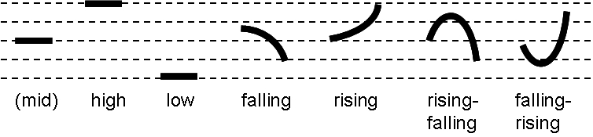

# 第一章：音位学

一门语言的音位学基本上指它的音系，即，它有系统地采用辅音、元音和如音高、重音（或语调重音）及声调的其他发声现象，以便按照自然规律，传达语言本身有意义的内容。 Ithkuil 的音位学详细介绍如下。

## 1.1 注意正字法和转写 {#Sec1o1}

Ithkui 的原生文字，表示既怪异又复杂。它会在第11章讲解。由于这种复杂性，在整个语法讲解中会使用罗马化系统，便于读者认清 Ithkuil 词的普遍语音结构。因为拉丁字母不足以完整转写一些 Ithkuil 中的音位（有意义的发音），所以各种变音符号很有必要。另外，有两个二合字母，**dh** 和 **xh**，各自代表一个音。

## 1.2 音系 {#Sec1o2}

 Ithkuil 有 45 个辅音和 13 个元音。下表 1 使用了一个特制的罗马化正字法，描述这些音位的位置和发音方式。

#### 表 1(a)与1(b)： 音系

##### 表 1(a): 辅音音系

|          |    塞音     |    塞擦音    |  擦音  |  鼻音  |  颤音  |  流音  |  近音  |
| :------: | :-------: | :-------: | :--: | :--: | :--: | :--: | :--: |
|  **双唇**  | p b pʰ p’ |           |      |  m   |      |      |      |
| **唇软腭**  |           |           |      |      |      |      |  w   |
|  **唇齿**  |           |           | f v  |      |      |      |      |
|  **齿**   | t d tʰ t’ |           | ţ dh |  n   |      |      |      |
|  **齿龈**  |           | c ż cʰ c’ | s z  |      |      |      |      |
| **齿龈卷舌** |           |           |      |      |  r   |      |      |
| **齿龈后**  |           | č j čʰ č’ | š ž  |      |      |      |      |
|  **硬腭**  |           |           |  ç   |      |      |      |  y   |
|  **软腭**  | k g kʰ k’ |           |  x   |  ň   |      |      |      |
|  **小舌**  |  q qʰ q’  |           |  xh  |      |      |      |  ř   |
|  **喉**   |     ’     |           |  h   |      |      |      |      |
| **齿边音**  |           |           |  ļ   |      |      |  l   |      |

##### 表 1(b): 元音音系

|      |  前   |      |  央   |      |  后   |      |
| ---- | :--: | :--: | :--: | :--: | :--: | :--: |
|      | 不圆唇  |  圆唇  | 不圆唇  |  圆唇  | 不圆唇  |  圆唇  |
| 闭    |  î   | (ü)  |      |  ü   |      |  û   |
| 半闭   |  i   |      |      |      |      |  u   |
| 中    |  ê   |  ö   |  ë   |      |      |  ô   |
| 半开   |  e   | (ö)  |      |      |      |  o   |
| 开    |      |      |  a   |      |  â   |      |

### 1.2.1 辅音读法 {#Sec1o2o1}

以下是 Ithkuil 辅音的近似描述。除了这些描述外，对于那些可能熟悉这些语音表记系统的读者，国际音标（IPA）的相应符号在括号中提供，还有它们的等同物 X-SAMPA。

|  辅音  | 详述                                       |
| :--: | ---------------------------------------- |
|  b   | 与英语一致。 浊不送气双唇塞音。IPA 及 X-SAMPA [**b**]    |
|  c   | 像英语中 *t*+*s* 的声音，比如 _bi**ts**_, _ma**te**_。浊齿龈塞擦音；清不送气颚龈塞擦音；IPA [**ʦ**]. X-SAMPA [**t_s**] |
|  č   | 如同英语的 _**ch**in_ 但比起英语中的此辅音，没有圆唇和送气(随同的喷气)的特点。清不送气颚龈塞擦音；IPA [**ʧ**]. X-SAMPA [**t_S**] |
|  ç   | 像这些首辅音，如英语的 _**h**uman_, _**h**uge_, _**h**ue_, 或德语的 _i**ch**_。清软腭擦音；IPA [**ç**]. X-SAMPA [**C**] |
|  d   | 类似于英语， 但发音时，舌尖顶着上门牙后，不抵住上齿龈脊。 浊不送气齿塞音；IPA [**d̪**]. X-SAMPA [**d_d**] |
|  dh  | 如同英语中的 _**th**is_, _ba**th**e_, _wea**th**er_. 浊齿擦音；IPA [**ð**]. X-SAMPA [**D**] |
|  f   | 与英语一致。清唇齿擦音；IPA 及 X-SAMPA [**f**]        |
|  g   | 像英语中的 _**g**a**g**_；不像 *ginger*。浊软腭塞音；IPA 及 X-SAMPA [**g**] |
|  h   | 如同英语中的 _**h**all_。注意，不像英语，它可以在 Ithkuil 的音节结尾出现。清声门过渡音；IPA 及 X-SAMPA [**h**] |
|  j   | 如同英语中的 _**j**u**dg**e_ ，但发音时不像英语要圆唇。 浊颚龈塞擦音； IPA [**ʤ**]. X-SAMPA [**d_Z**] |
|  k   | 近似于英语中的 _**k**_ 音，但不送气。像罗曼语族中的 _**k**_ 音，如西班牙语或意大利语的 _**c**asa_。清不送气软腭塞音； IPA 及 X-SAMPA [**k**] |
|  l   | 罗曼语族中，即音色亮的「light」_**l**_ 音，或像英国英语中的 _**l**eader_ 不像美国英语中的 _**l**u**ll**_ ，即音色暗的「dark」（软腭）_**l**_ 音。齿龈边近音；IPA 及 X-SAMPA [**l**] |
|  ļ   | 英语无。清齿龈边擦音，可在威尔斯语中的 _**ll**an_ 找到。最好通过将舌头放在适当的位置， 即 *l* 音，在持有这个位置的同时，发出一个强力的 *h* 音代替； IPA [**ɬ**]. X-SAMPA [**K**] |
|  m   | 与英语一致。双唇鼻音；IPA 及 X-SAMPA [**m**]         |
|  n   | 近似于英语中的，但它发音像罗曼语族中的，要舌尖顶着上门牙后，不像英语抵住上齿龈脊发音。齿鼻音； IPA [**n̪**]. X-SAMPA [**n_d**] |
|  ň   | 英语中的 *ng* 音，比如 _so**ng**_ 或 _ri**ng**er_；不是 _fi**ng**er_。软腭鼻音；IPA [**ŋ**]. X-SAMPA [**N**] |
|  p   | 近似于英语中的，但不送气。发音像罗曼语中的。 清不送气双唇塞音；IPA 及 X-SAMPA [**p**] |
|  q   | 英语无。清不送气小舌塞音，可在阿拉伯语、因纽特语、许多美国印地安语和高加索诸语言找到。 它的发音近似于不送气的 *k* 音 但舌头接触的不是软腭而是小舌（小「沙袋」悬挂在软腭正中央的尾端）。IPA 及 X-SAMPA [**q**] |
|  r   | 这是一个舌尖轻微闪颤一下的音，像西班牙语的 *ca**r**o* 或 *pe**r**o*。当它双写时就变成一个颤音，像西班牙语的 *ca**rr**o* 或 *pe**rr**o*。齿龈闪音/颤音；IPA [**ɾ**], [**r**]. X-SAMPA [**4**], [**r**] |
|  ř   | 英语无。像声音低沉或「漱口」的 *r* 音，可在法语口语和德语中找到。浊小舌擦音(不是颤音)； IPA [**ʁ**]. X-SAMPA [**R**] |
|  s   | 如同英语中的 _**s**i**s**ter_。清齿龈擦音；IPA 及 X-SAMPA [**s**] |
|  š   | 如同英语中的 _**sh**oe**sh**ine_，但发音时不像英语要圆唇。清不圆唇齿龈后音； IPA [**ʃ**]. X-SAMPA [**S**] |
|  t   | 近似于英语中的发音，但没有送气，以及舌尖要顶着上门牙后，不像英语要抵住上齿龈脊。像罗曼语中的。清不送气齿塞音；IPA [**t̪**]. X-SAMPA [**t_d**] |
|  ţ   | 如同英语中的 _**th**in_, _ba**th**_。清齿擦音； IPA [**θ**]. X-SAMPA [**T**] |
|  v   | 如同英语中的。浊唇齿擦音；IPA 及 X-SAMPA [**v**]       |
|  w   | 如同英语中的 _**w**ell_, _**w**orry_。浊圆唇软腭近音； IPA 及 X-SAMPA [**w**] |
|  x   | 英语无。清软腭擦音，可在俄语（在西里尔字母拼写成 **х** ）和拉丁美洲（但不在卡斯蒂利亚）西班牙语的 **j** 找到。可以通过将舌头放在适当的位置来近似，就像发出 *k-* 声一样，并在舌头保持在该位置时，呼出 *h* 音置换。IPA 及 X-SAMPA [**x**] |
|  xh  | 英语无。 清小舌擦音（或颤音），可在德语 _a**ch**_ 中找到。可以用不带声带振动的干漱口的手段来近似。IPA [**χ**]. X-SAMPA [**X**] |
|  y   | 如同英语中的 _**y**et_, _**y**am_。硬腭近音；IPA 及 X-SAMPA [**j**] |
|  z   | 如同英语中的 _**z**oo_, _wi**z**ard_。浊齿龈擦音；IPA 及 X-SAMPA [**z**] |
|  ż   | 像英语中 *d*+*z* 的声音，比如 _roa**ds**_, *a**dz**e*。浊齿龈塞擦音；IPA [**dz**]. X-SAMPA [**d_z**] |
|  ž   | 与 **š** 对立的浊音。近似于英语中的 *plea**s**ure* 或 *lei**s**ure* 发音，但不圆唇。浊不圆唇齿龈后音；IPA [**ʒ**]. X-SAMPA [**Z**] |
|  ’   | 此音是在英语 o*h*-o*h* 的两个元音之间听到的声门停顿，或作为在大多数讲美国英语的人发 *fa**tt**ening* 此词中听到的声音。此音在其他语言（如夏威夷语，阿拉伯语，希伯来语等）中十分常见。清声门塞音；IPA [**ʔ**] |

#### 1.2.1.1 送气辅音 {#Sec1o2o1o1}

这些辅音，**p**, **t**, **k**, **q**, **c** 和 **č** 都不送气，即无英语塞音及塞擦音伴随而来的喷气特征。在 Ithink，这些辅音都有它们的送气对立，发音像不送气辅音，但带有明显的空气排出，尤其像英语里中的。这些送气辅音用一个跟随着的上标 ***h*** 表记，因此有了：**pʰ**, **tʰ**, **kʰ**, **qʰ**, **cʰ** 和 **čʰ**。

#### 1.2.1.2 挤喉辅音 {#Sec1o2o1o2}

上面相同的六个辅音也具有挤喉对立，它们不存在于任何西方语言中，但是存在于诸如阿姆哈拉语、格鲁吉亚语、大多数高加索语言和许多美洲印第安语中。挤喉音（也称为声门化辅音）是伴随着声门同时闭合和突然释放声门（声带）的辅音，这给了声音一个明显的「爆裂」或爆破性质。挤喉辅音用辅音旁的撇号表示，因此有了：**p’**, **t’**, **k’**, **q’**, **c’** 和 **č’**。

#### 1.2.1.3 成音节辅音 {#Sec1o2o1o3}

这些辅音，**l**, **m**, **n**, **ň,** 和 **r** 可以在没有元音的情况下构成完整的音节。 在口语的英语表达中，音节辅音的现象是相当普遍的，例如「hmm」(当思考一下时)，，「mm-hmm」 (表达批准或同意)，以及如在 *button* 和 *little* 这两个词的第二音节，有辅音 *n* 和 *l* 的成音节。在 Ithkuil 中, 这五个音节辅音可以出现在辅音之前的词首音节，如 **ntal**。并且，他们也出现在特殊的复辅音（即，辅音延长）丛中，其中复辅音丛的第二个「一半」被发音为单独的音节。为了表记这些特殊的双音节辅音延长，得在两个音节「一半」之间写下一个连字符，如 *ho**m-m**, i**l-l**ui, ti**ň-ň**ax* 音节辅音被列为重音规则的完整音节 (看 [第 1.3.3 节](01_phonology.md#Sec1o3o3))。

### 1.2.2 元音读法 {#Sec1o2o2}

有 13 个元音，都是单元音，不像英语中被滑动为双元音。

| 元音   | 详述                                       |
| ---- | ---------------------------------------- |
| a    | 开前不圆唇元音，像西班牙语或意大利语。IPA 及 X-SAMPA [**a**] |
| â    | 开后不圆唇元音，美式英语的 _**a**ll_, 或 法语保守读法的 *p**â**te*。 IPA [**ɑ**] |
| e    | 半开前不圆唇元音，如英语的 *b**e**t*, 意大利语的 *l**e**tto*, 或法语的 _**ê**tre_。 IPA [**ε**] 或 X-SAMPA [**E**]. 当跟着除了 **u** 以外的元音，就像立刻发出下面的元音 **ê** ，只是比较短 |
| ê    | 半闭前不圆唇元音，如西班牙语的 _**e**st**e**_ 或意大利语的 *cad**e**re* 或法语的 *d**é**jà*，长音。IPA 或 X-SAMPA [**e:**] |
| i    | 次闭次前不圆唇元音，如英语中的 *s**i**t*，或德语的 *s**i**tzen*。 IPA [**ɪ**] 或 X-SAMPA [**I**]。在一个单词的结尾或当跟着除了 **u** 以外的元音，就像立刻发出下面的元音 **î** ，只是比较短 |
| î    | 闭前不圆唇元音，西班牙语或意大利语的 *l**i**bro*, 法语的 *l**i**tre*, 长音。 IPA 或 X-SAMPA [**i:**] |
| o    | 半开后圆唇元音，如英语的 *sh**o**rt* 或意大利语的 _**o**tto_。 IPA [**ɔ**] 或 X-SAMPA [**O**]。当跟着除了 **i** 以外的元音，就像立刻发出下面的元音 **ô** ，只是比较短 |
| ô    | 半闭后圆唇元音，如西班牙语或意大利语 *c**o**sa*，长音。 IPA 或 X-SAMPA [**o:**] |
| u    | 次闭次后圆唇元音，如英语的 *p**u**t* 或 *l**oo**k* 或德语的 *p**u**tsch*. IPA [**ʊ**] 或 X-SAMPA [**U**]。在一个单词的结尾或当跟着除了 **i** 以外的元音，就像立刻发出下面的元音 **û**，只是比较短 |
| û    | 闭后圆唇元音，如西班牙语或意大利语 *p**u**ta* 或 *cr**u**do*，长音。IPA 或 X-SAMPA [**u**:] |
| ë    | 中央元音，如美式英语的 *c**u**t* 或 *n**u**t*，IPA [**ə**] 或 X-SAMPA [**@**] |
| ö    | 此音有两种可能的发音方式： (1)半闭前圆唇元音，如法语的 _f**eu**_, IPA [**ø**] 或 X-SAMPA [**2**]；或 (2) 半开前圆唇元音，如法语的 *n**eu**f*, IPA [**œ**] 或 X-SAMPA [**9**] |
| ü    | 闭央圆唇元音，可在挪威语找到 *h**u**s* 或高地苏格兰英语发音 *b**oo**k* 或 *g**oo**d*; IPA [**ʉ**] 或 X-SAMPA [**}**]。如果这对演讲者来说更容易，此音可能被发成闭前圆唇元音，如法语的 _d**u**_ 或德语的 _**ü**ber_，IPA 或 X-SAMPA [**y**] |

#### 1.2.2.1 在声门停顿后的增音 {#Sec1o2o2o1}

在 Ithkuil 词，当声门停顿（拼写 ’）后面是辅音（例如，如 **ka’tal** 或 **morui’ss**）时，在紧跟的辅音之前通常会有一个非常短暂的元音被发出。此音可能以两种方式中的任何一种发音，两者以说话者更容易为准。第一个是闭央不圆唇元音，如俄语的 б**ы**ть, IPA [**ɨ**] 或 X-SAMPA [**1**]。第二是发成闭后不圆唇元音，可在土耳其语找到 (拼写是无点的 i), IPA [**ɯ**] 或 X-SAMPA [**M**]。这两个元音的持续时间都非常短，如果紧跟的辅音乃清音，甚至可能会失去声音。

### 1.2.3 双元音 {#Sec1o2o3}

一个 Ithkuil 音节可能包含一个双元音（两个元音的组合，协同发音为一个音节）。 在 Ithkuil ，所有的双元音都是「下降」的双元音，即，以响度较高的元音开始，以响度较低的元音结束（有时被称为半辅音或「滑动」）。 Ithkuil 有 12 个双元音，描述如下：

| 元音   | 详述                                       |
| ---- | ---------------------------------------- |
| ai   | 与西班牙语或意大利语一致；像英语的 **i** 如 *wh**i**te* 或 _**i**ce_ |
| ei   | 与西班牙语或意大利语一致； 像英语 *r**ai**n* 的 **ai** 或在 *r**ei**n* 的 **ei** |
| ëi   | 标准英语无；一个元音的组合，美式英语的 *r**u**t* + 一个英语的 *y* 音。 有点像乡村英国方言 *ice* 的 *i* 发音 |
| oi   | 与西班牙语或意大利语一致； 如同英语中的 _b**oy**_ 或 *v**oi**ce* |
| öi   | 英语无。一个元音的组合， Ithkuil 元音 **ö** 加 英语 *y* 音。很像一个法语词 _**oei**l_ |
| ui   | 一个元音的组合， Ithkuil 元音 **u** [**ʊ**] + 英语 *y* 音。说话者应避免它变成一个「上升」双元音，即 *u* 音读成 *w*- (听起来像英语 *wee*)。此双元音也能读成闭后圆唇元音 /**u**/ + 英语 *y* 音，像西班牙语或意大利语一样 |
| au   | 与西班牙语或意大利语一致； 像英语 *l**ou**d* 的 *ou* 或 _c**ow**_ 的 *ow* |
| eu   | 与西班牙语或意大利语一致； 英语无。 一个元音的组合， Ithkuil 元音 **e** + 英语 *w* 音 |
| ëu   | 标准英语无；一个元音的组合，美式英语 *r**u**t* + 英语 *w* 音。有点像乡村英国方言发音的 *oh!* |
| iu   | 英语无；一个元音的组合， Ithkuil 元音 **i** (IPA /ɪ/) + 英语 *w* 音。可能被读成闭前不圆唇元音 /i/ + 英语 *w* 音，如同葡萄牙语 _part**iu**_ |
| ou   | 像英语的 *r**oa**d* 或 *m**o**de* 的 *o* + *w* 滑下。也如巴西葡萄牙语 *r**ou**pa* |
| öu   | 英语无。一个元音的组合， Ithkuil 元音 **ö** + 英语 *w* 音。听起来像夸张的上层阶级英语发音的 *oh!* |

所有其他元音组合都是非音节的，即发音为两个单独的音节。应注意避免将许多以 **u-** 和 **i-** 开头的双元音组合读成以 *w* 音或 *y* 音开始的「上升」双元音。当这些组合的第二个元音得到音节重音时，这一点尤为重要。

#### 1.2.3.1 将双元音分离成独立音节 {#Sec1o2o3o1}

当上述十二个双元音中的一个表示 第 8 位 **Vc** 格中缀（见 [第 2.1.1 节](02_morpho-phonology.md#Sec2o1o1) 的说明）时，双元音可能与倒数第二或第三的重音一起，任意地分成词中的两个独立音节（见下面的 [第 1.3.3 节](01_phonology.md#Sec1o3o3)），以便在应用了重音规则的单词中提供足够数量的音节。为了这个目的，当双元音分解成独立音节时，双元音的第二个字母（即，**-i** 或 **-u**）在其上方带有一个扬抑符，以显示此音节划分。 在这种情况下，这个扬抑符不表示长音，只是音节的划分。

### 1.2.4 双音节附加符号的正字法表记 {#Sec1o2o4}

双音节结合，无论在哪里，他们都可能与双元音混淆，在第二个元音上写着重音符 ( ` ) ，表示它是一个单独的音节（除非这个第二个元音其实是重音音节 - 见下文 [第 1.3.3 节](01_phonology.md#Sec1o3o3) 关于重音表示的规则）。例如，双元音 **au** 与双音节结合 **aù** 不同。

### 1.2.5 异音区别 {#Sec1o2o5}

异音区别是语音变动，带来一个特定音素的发音，取决于该音素遇到的语音环境。这些差异，被称为异音，虽然训练有素的语言学家可以听到，但特定语言的外行母语者通常是不能区分它们的，因为这些异音区别不会改变一个词的意义，所以在语言中起不到任何作用。例如，比较英文单词 _**t**op_ 和 *s**t**op* 中的两个 *t* 音。 前者送气（即，伴随着清晰的空气送出），而后者不送气，使两个声音具有不同的语音性质。然而，由于送气辅音在英语中不起音位作用，所以对于大多数英语母语者来说，这两个 *t* 音的区别不明显，尽管它对区分两者语言的说话者非常引人注目（例如，印地语 和许多其他印度语言）。

虽然在某种语言中这种差异性的区别是任意的，但并非随机。相反，对于任何特定语言，他们的模式是完全规则和可预测的（正如英语的送气辅音）。在学习外语时，若不遵守外语差异的规则会导致母语者觉得演讲者有明显的「外来口音」。在学习外语时，若不遵守外语差异的规则会导致母语者觉得演讲者有明显的「外来口音」。（大多数法语，意大利语和西班牙语使用者在尝试发英语 “top” 时，首 *t* 音不送气 ，这是因为在罗曼语族中缺乏送气辅音）。

#### 1.2.5.1 辅音异音 {#Sec1o2o5o1}

 Ithkuil 辅音的明显异音区别如下：

| 辅音异音                   | 详述                                       |
| ---------------------- | ---------------------------------------- |
| dy                     | 这个辅音丛可能会被拼写， 浊硬颚塞音，可在匈牙利语和捷克语找到，分别拼写成 *gy* 和 *d´* 。类似英语中*bi**g y**ear* 快速连读的 *g* + *y* 音，与 *g* 音发音，舌头对着硬腭而不是软腭。IPA [**ɟ**]. X-SAMPA [**J\\**] |
| hh                     | 可用两种方式发音：(1) 作为「双齿」擦音，下颚完全关闭，上下齿沿其整个长度接近接触；所产生的声音在音色上有些类似于清齒擦音（如英语 _**th**in_）以及英语 *f* 音，但发音时，舌头与牙齿或牙龈完全不接触；IPA 无；或者 (2) 清咽擦音，可在阿拉伯语 (拼写成 ح)、诸东北、西北高加索语族找到。如果所产生的咽喉化使相邻元音的音色扭曲到其发音位置变化的程度，则不应该使用第二个异音位 (如，元音 **û** 发得像 **ô**) |
| ly                     | 这个辅音丛可能会被拼写， 硬腭边音，可在卡斯蒂利亚西班牙语， *ca**ll**e* 、葡萄牙语 *o**lh**ar* 或意大利语 *e**gl**i* 找到。对于英语人士来说，这可以通过将舌头置于 **y**es 的 **y** 的位置来最好地近似，同时保持舌头平坦地抵靠硬腭，而不是将舌头的舌尖接触到前牙后面的牙槽嵴上， 发出一个 **l** 音。IPA [**ʎ**]. X-SAMPA [**L**] |
| ny                     | 这个辅音丛可能会被拼写， 硬颚鼻音，可在西班牙语 *a**ñ**o*、意大利语 *a**gn**ello*、葡萄牙语 *cami**nh**o* 或法语 *champa**gn**e* 找到。对于英语人士来说，这可以通过将舌头置于 **y**es 的 **y** 的位置来最好地近似，而不是将舌头的舌尖接触到前牙后面的牙槽嵴上， 发出一个 **n**音。IPA [**ɲ**]. X-SAMPA [**J**] |
| ř                      | 在正常谈话中，此音位发成濁小舌近音（非颤动）持续，类似法语口语和德语的喉音 *r*，IPA [**ʁ**]. 但当强调发音或需超明确的谈话中，它会变成小舌颤音， IPA [**ʀ**] |
| řx                     | **X** 前加上 **ř** 的组合，导致 **x** 发音为清小舌擦音，如德语 *Ba**ch*** 或卡斯蒂利亚西班牙语发音的 **j** |
| ty                     | 这个辅音丛可能会被拼写， 清硬颚塞音， 清对立于 **dy** 。像 *k* 音不送气（即，无伴随而来的空气喷出）并 舌头的后半部分抵住硬腭而发出的声音，不是英语中的软腭 **k**。结果应该听起来在 *ba**cky**ard*， *k*+*y* 快速发音。IPA 及 X-SAMPA [**c**] |
| bm, dn, km, kn, pm, tn | 当在单词初始位置时，这些组合的第一个辅音发音时空气会从鼻逸出而不是嘴巴。为了达到这个目的，将舌头和 / 或嘴唇放在第一个辅音发音的位置，气由肺部经声道直接流出，但不要释放声音，也不需移动舌头或嘴巴，直接发出第二个鼻辅音 |
| hl, hm, hn, hň, hr, hw | 这些辅音组合中的每一个，当初始单词或初始音节跟随另一个辅音时，不会被发音为单独的辅音，而是形成第二个组合对立的清流音或鼻音。为了近似这些声音，把嘴放在 **l**, **m**, **n**, **ň**, **r**, 或 **w** 的位置，也不需移动舌头或嘴巴，呼出一个清晰的 *h* 音代替 |
| ’                      | 如[第 1.2.2.1 节](01_phonology.md#Sec1o2o2o1)所述，在 Ithkuil 词，当声门停顿（拼写 ’）后面是辅音（例如，如 **ka’tal** 或 **morui’ss**）时，在紧跟的辅音之前通常会有一个非常短暂的元音被发出。此音可能以两种方式中的任何一种发音，两者以说话者更容易为准。第一个是闭央不圆唇元音，如俄语的 б**ы**ть, IPA [**ɨ**] 或 X-SAMPA [**1**]。第二是发成闭后不圆唇元音，可在土耳其语找到 (拼写是无点的 i), IPA [**ɯ**] 或 X-SAMPA [**M**]。这两个元音的持续时间都非常短，如果紧跟的辅音乃清音，甚至可能会失去声音 |

#### 1.2.5.2 元音异音 {#Sec1o2o5o2}

如[第 1.2.2 节](01_phonology.md#Sec1o2o2)所述， Ithkuil 元音 **i** 和 **u** 有两个不同的发音。具体来说，如果它们自己出现，而不是与另一个元音相邻，或者不是双元音的一部分，它们就分别发音为美式英语 *s**i**t* 和 *p**u**t* 的元音。然而，当双音节元音的一部分结合时，他们的发音如下：

| i 和 u 的元音异音                              |
| :--------------------------------------- |
| 对于以元音 **i-** (例如，**ia**, **ie**, **io**, **iù** 等）开始的双音节元音组合，初始 **i-** 发成闭前不圆唇元音，西班牙语或意大利语的 *l**i**bro*, 或德语的 *s**ie**gen* 。IPA 或 X-SAMPA [**i**] |
| 对于双音节元音组合的第二个元音是 **i**，（例如，**aì**, **uì**, **öì** 等），这个 **i** 可能发成英语 *s**i**t* 和德语 *s**i**tzen* 的元音 ，IPA [**ɪ**], 次闭次前不圆唇元音，或是西班牙语或意大利语 *l**i**bro* 或德语 *s**ie**gen* 的闭前不圆唇元音。IPA 或 X-SAMPA [**i**] |
| 对于以元音 **u-** （例如，**ua**, **ue**, **uo**, **uì**等）开始的双音节元音组合，初始 **u-** 发成闭后圆唇元音，如西班牙语和意大利语的 *p**u**ta* 或 *cr**u**do*。IPA 或 X-SAMPA [**u**] |
| 对于双音节元音组合的第二个元音是 **u**，（例如，**aù**, **iù**, **öù** 等），这个 **u** 可能发成英语 *p**u**t* 和德语 *p**u**tsch* 的元音，IPA [**ʊ**] 或 X-SAMPA [**U**]，次闭次后圆唇元音，或西班牙语或意大利语 *p**u**ta* 或 *cr**u**do* 闭后圆唇元音。IPA 或 X-SAMPA [**u**] |
| 在单词结尾的元音 **i**，当非双元音的一部分时，发成西班牙语或意大利语 *l**i**bro* 或德语 *s**ie**gen* 的闭前不圆唇元音。IPA 或 X-SAMPA [**i**]。同样道理，元音 u 在单词结尾且非双元音的一部分时，西班牙语或意大利语 *p**u**ta* 或 *cr**u**do* 的闭后圆唇元音。IPA 或 X-SAMPA [**u**] |

| 额外的元音异音                                  |
| ---------------------------------------- |
| 对于以元音 **e-** 开始，且第二元音除了 **ì** 或 **ù** 以外的双音节元音组合（例如，**ea**, **eo**, **eö** 等），初始 **e-** 发成半闭前不圆唇元音，如西班牙语的 _**e**st**e**_ 或意大利语的 *cad**e**re* 或法语的 *d**é**jà*； IPA 或 X-SAMPA [**e**] |
| 对于以元音 **o-** 开始，且第二元音除了 **ì** 或 **ù** 以外的双音节元音组合（例如 **oa**, **oe** 等），初始 **o-** 发成半闭后圆唇元音，如西班牙语或意大利语 *c**o**sa*；IPA 或 X-SAMPA [**o**] |

## 1.3 语音规则 {#Sec1o3}

除了音系外，语言都有语音过程，影响着这些辅音或元音的组合和语音表达。通过这些语音过程，语言中字词形成音节的可能数量有所扩大。 Ithkuil 有效地利用复辅音、音节重音变化和音调（音高语调）来实现这些目的。 

### 1.3.1 辅音延长 {#Sec1o3o1}

辅音延长指特定声音发出的时间持续延长，通常指辅音。虽然在真正的语音学理论基础上，英语并不会发生辅音延长，但它确实发生在形态语音学上，如 「a natural」 和 「unnatural」 一词的发音差异所见。然而，有许多语言，其中基于语音学的辅音延长是语音学的固有组成部分（例如意大利语，日语，芬兰语）。

在 Ithkuil ，大多数辅音都可以延长。 另外要注意的是，允许在单词初始和结束出现某些辅音的延长。以下是辅音延长的具体规则：

#### 1.3.1.1 元音间的辅音延长 {#Sec1o3o1o1}

全部辅音都能在元音间延长 (即，当在两个元音之间时) ，除了 **y**, **w** 和 声门停顿 **’**。

#### 1.3.1.2 词首词尾的辅音延长 {#Sec1o3o1o2}

以下辅音，除了能够在元音间延长之外，还能在词首词尾延长：**c**, **ç**, **č**, **j**, **l**, **m**, **n**, **ň**, **r**, **ř**, **s**, **š**, **z**, **ż** 和 **ž**。

#### 1.3.1.3 延长辅音的发音 {#Sec1o3o1o3}

辅音都是连续的（即，能无时限发音），特别是 **ç**, **dh**, **f**, **l**, **m**, **n**, **r**, **ř**, **s**, **š**, **ţ**, **v**, **x**, **z**, 和 **ž**, 在延长的时候，可轻易发出两倍的持续时间。双辅音 **r** 发成齿龈颤音，像西班牙语或意大利语的 *rr*.

不送气塞音 **b**, **d**, **g**, **k**, **p**, **q** 和 **t**, 当延长时, 暂时保持，然后释放。当说得较快时，很像英语短语 *ba**d d**og* 的两个 *d* 连读。 对于他们的送气音或挤喉音，释放时会发生送气或喷音。

塞擦音的发音 (**c**, **č**, **j**, 和 **ż**) 当延长时，取决于他们是否位于元音间的（两个元音之间）还是词首词尾上。如果是元音间的，他们的读法是，在将其释放到塞擦音的擦音或有咝擦音部分之前，暂时保持初始停顿（塞音）部分，如， **čč** 发音为 [**ttš**]。对于他们的送气音或挤喉音，在释放进入塞擦音的擦音部分的过程中发生送气或喷音。 当位于词首词尾时，可简单延长塞擦音的有咝连续部分，得到延长的发音（即，每个塞擦音的第二个声音）。因此， **čč** 位于词首词尾时发音为 [**tšš**].

#### 1.3.1.4 辅音延长的罗马化正字法 {#Sec1o3o1o4}

复辅音可简单写两个单字符得到，如, **bb**, **čč**, **dd**, **nn**, **šš**。而送气音和挤喉音在第二个字符后才表记上标 h 或变音符号撇号，如，**čč’**, **ttʰ**. 这两个二合字母 **dh** 和 **xh** 当延长时写成 **ddh** 和 **xxh**。

### 1.3.2 声调 {#Sec1o3o2}

 Ithkuil 是一种有声调的语言，像汉语、越南语和其他东南亚语言，以及大多数撒哈拉以南的非洲语言和一些美洲印第安语言。这意味着语音的声调用于传达语法信息，不像西方语言， 使用声调和音高改变「超音段成分」来标记各种形态语义特征。例如，在英语，声音的上升语调暗示它是个问题。而其他特定的音调轮廓表示强调，厌恶，讽刺和其他态度。 Ithkuil 在形态上标记这样的特征，即在单词本身内（例如用词缀或心情类别的变动）。

 Ithkuil 有七种音调，其中一个，中调，在形态音韵学上表示中性。其他六个声调有：**低调（low）**, **高调（high）**, **降调（falling）**, **升调（rising）**, **升降调（rising-falling）** 和 **降升调（falling-rising）**，具有着功能上的意义。每个单词都有一个功能上的意义的声调，与重音音节开始发音，并持续携带通过任何以下音节直到单词的结尾。 非重音音节在重音音节之前有中性的中调。 因为任何前一个单词必须以除中调以外的音调结束，因此，中音的功能仅仅是指示一个新单词的开始。像自然的声调语言一样，声调不对应于任何精确的音高，但是对每位单独的说话者和发音都是相对的。声调的相对音高如下所示：

#### 1.3.2.1 用罗马化转写表记声调 {#Sec1o3o2o1}

在罗马化转写中，六个重要的音调用紧跟在单词第一个字母前面的读音符号表示，如下：

- 不标降调
- 低调由下划线表示 (如 _ )
- 高调由长音符号或上标的破折号表示 (如 – )
- 升调由上标的斜线表示 (如 / )
- 降升调由抑揚符或短音符表示 (如 ˇ 或 ˘ ), 或者如果这些符号都不可用，则用上标的波浪号 (如 ~)
- 升降调由揚抑符表示 (如 ^ )

### 1.3.3 音节重音 {#Sec1o3o3}

重音通常落在**倒数第二个音节**上，但也可以转移到**最后一个音节**上，或**倒数第三个音节**上，偶尔到**倒数第四个音节**上，这是形态（语法）考虑所决定的。

当把 Ithkuil 转写成拉丁字母时，由于拉丁字母元音数量有限， Ithkuil 的元音需要使用变音符号。 因此，使用罗马化系统的重音正字法表记变得复杂。解释如下：

1. 所有单音节词都没有标记重音。
2. 重音符 ( **`** ) 在重音时指定为一个非重音音节否则会被误解，例如， 在区分单音节双元音，如 **au** 和 **ei** 和双音节元音组合 **aù** 和 **eì**。
3. **倒数第二个音节重音**。 多音节单词虽然有倒数第二个音节但不标记重音，两个音节的元音，第二个加重音符表示第一个重读， **aì** 或 **aù** ，加上尖音符则本身重读。例如，单词 **iskoùt**（重音在 **o**）如重音移动至最后一个音节，变成 **iskoút** （重音在 **u**）
4. **最终音节重音**。具有最终音节重音的多音节词以下列方式之一表明：
   - 无标记元音 **a**, **e**, **i**, **o**, **u**, 和带标记双音节元音 **ì** 和 **ù** 加上尖音符, 例如 **á**, **é**, **í**, **ó**, **ú**.
   - 如果要强调的元音已经带有符号（除了重音符）及元音、双元音或成音节流音或鼻音在倒数第二个音节中，那么这个倒数第二个音节加重音符，例如 **ròihnâl**.
   - 如果这个词至少有三个音节，并且最后两个音节中的元音或双元音带有变音符号，那么重音符落在倒数第三个音节上就代表最终音节是重音。（若这个单词是倒数第二个音节重音，重音符是不需要的）例如 **òspâtlök**.
   - 如果最终和倒数第二个音节中的元音（或双元音）已经具有变音符号（除了重音符），并且没有任何上一个音节（或者它也带有一个预先存在的读音符号），那么这个重音元音要双写，例如 **ksûtpöör**.
5. **倒数第三个音节重音**标记倒数第三个音节的重音
   - 如果要强调的元音（及双元音或成音节流音或鼻音）不携带任何符号（除了重音符），加上尖音符，例如 **áksiyor**
   - 如果要强调的元音已经带有符号（除了重音符），那么在最终音节或其他非变音符号的元音上使用重音符加上尖音符的缺乏来表示重音，例如 **ëitlàrrun**, **ôrümzìl**. (请注意，如果这个词带有倒数第二音节重音，那么在 **ôrümzìl** 中的 **i** 使用重音符是不必要的，因此它的存在意味着倒数第三个音节重音) 。
   - 如果现有的变音符号使用上述规则而避免了明确指示，重音元音双写，例如 **öömolûk**.
   - 为了使用倒数第三个音节重音，可选择将双元音分隔成单独的音节，以增加音节数。看 [第 1.2.3.1 节](01_phonology.md#Sec1o2o3o1)
6. **倒数第四个音节重音**。标记倒数第四个音节的重音，上面倒数第三个音节重音的同样规则，倒数第四个音节重音也可以使用。为了使用倒数第四个音节重音，可选择将双元音分隔成单独的音节，以增加音节数。看 [第 1.2.3.1 节](01_phonology.md#Sec1o2o3o1)

- ##### 重音规则简记：

  - 单音节词，或重音在倒数第二音节，不标记。
  - 其余情况下用尖音符，如 **á** 。双元音标在第一个字母如 **ái**。
  - 两个音节的元音，第二个加钝音符表示第一个重读，如 **aì**（重音在 a）。加尖音符则本身重读。
  - 对于本身带符号的元音，①在相邻的无符号元音上加钝音符，如 **àkâl**（重音在 â），**ëitlàrrun**（在 ëi）；若相邻元音仍有符号，则再到下一个，**òspâtlök**（在 ö），**ôrümzìl**（在 ô）②别无他法时，双写，如 ââ。

注意：在 Ithkuil 中的单音节词将被语法解释为具有倒数第二个音节重音的等效词。当需要单音节词在语法上表记成等效的最终或倒数第三个音节重音时，额外的音节 (元音 **-a-**) 被添加到单词中，以便允许落下重音在必要的最终或倒数第三个音节，例如 **kust → kustá**, **kust → ákusta**.

## 1.4 语音组合法 {#Sec1o4}

除了语音过程，如辅音延长，重音变化和声调，所有语言都使用自己个体人且任意的规则，以便在音节或单词中允许辅音和元音的组合。这个概念被称为**趋声性**，这种规则被称为语音规则。这些规则是每种语言特有的，例如说明了为什么 *sprelch* 可能是一个英语假设的词， 而 *znatk* 不可能，即使语言学家可以 像 *sprelch* 一样容易地发出 *znatk*。规则规范着音节结构，双元音形式和整体语音谐音，这些都是趋声性的一部分。

同样重要的是每个语言都采用的可选规则，以实现谐音和更简单的发音，被称为音义学（phonaesthetics）或音义（phonaesthetic）规则。趋声性和音义学对语音「角色」或特定语言的主观「声音」负责。以下部分介绍了 Ithkuil 的趋声性和音义规则。

### 1.4.1 音节结构 {#Sec1o4o1}

合法的音节结构取决于音节是否构成单音节词、词首音节、还是个字尾音节、或者词内音节（即两个音节之间）。这些结构如下表 2 所示，其中（C）表示可选辅音，V 表示强制元音或双元音。

#### 表 2: 音节结构

| 音节类型 | 结构                                      | 例子                                       |
| ---- | --------------------------------------- | ---------------------------------------- |
| 辅音词  | **C(C)(C)** <u>结尾辅音为鼻音、流音或清擦音持续</u>     | s, h, ll, mm, pçç                        |
| 单音节  | **(C)(C)(C)V(C)(C)(C)**                 | a, ui, öt, isk, du, tuil, kleb, tlips, pskarn, xxoršt |
| 词首   | **(C)(C)(C)V(C)-** 或 **l, m, n, ň**     | uran, tamin, uisá, prine, klâtma, kstollap, ltas, mpeisku |
| 词内   | **-(C)(C)V(C)(C)-** 或 **l, m, n, ň**    | kialùn, ruentik, isteixlom, okspûtkai, hen-nau |
| 词尾   | **-(C)(C)V(C)(C)(C)-** 或 **l, m, n, ň** | lua, entoi, tial, eifkés, poxšurn, erpsalks, ön-n |

以下规则适用：

- 一个单一的、非音节的、发生在元音之间的辅音是，上一个元音音节的一部分，不跟着下一个元音。（并非元音前）

- 一个发生在元音之间的双辅音组合被认为是非音节性的（即每个辅音是不同音节的一部分），即使这个组合是一个辅音延长。

- 如果在词中出现三个辅音，则这三个中的首辅音必须在一个与这三个中的尾辅音分开的单独音节中。中间辅音将在同一个音节中，作为将与两个周边辅音的任意一个，这样它就形成一个合法的词首或词尾丛。如果它可以与周边辅音形成合法丛，则它将被认为是与词素附随物关联的音节的一部分。

### 1.4.2 元音限制 {#Sec1o4o2}

以前提到的所有元音、双元音和双音节元音组合可以发生在任何音节中，然而，可以立即发生的最大数量的双音节元音是两个。如果两个音节的一个是双元音，那么此双元音必须是第二个音节。紧跟一个双元音的任何音节都要以一个辅音开头。不允许使用三音节元音（或更多）。因此，诸如 **dea** 或 **aitua** 或 **ruai** 是允许的，但像 **oia**, **tuoa**, **auem**, 和 **laúio** 的词则不是。

### 1.4.3 辅音限制 {#Sec1o4o3}

- 辅音 **w** 和 **y** 不能在音节末尾，其後须有元音。 
- 喉塞音 (**’**) 不能在词首，除非用于音渡作用 （即，两个单独的词汇在一起）。具体来说，当一个单词以元音结尾并且下一个单词以元音开始时， Ithkuil 会在第二个单词的开头，语音上地插入一个喉塞音分离单词，避免第一个单词的词尾元音与第二个字的词首元音合并。这有助分清两个词。 这个喉塞音在罗马化转写中没有标记。 在其他地方，喉塞音可能会出现在元音之间，或者如果在元音前面，可能出现在音节尾。
- 词首辅音不能超过四个，其中前三个辅音必须能形成允许的音节末尾组合。元音之间辅音不能超过五个，其中前两或三个和後两或三个辅音必须能分别形成允许的音节末尾和音节开头的组合。 例子：**kstruifântu, alzmweit**, **urpstwam**. 
- 对于元音之间的三辅音组合，组合的首辅音或尾辅音必须在另外两个辅音的单独音节中。如果首辅音从另外两个辅音分开，是个双音节，则其他两个辅音必须是允许的音节首组合。如果第三从首两个辅音分开，是个双音节，则首两个辅音必须是允许的音节尾组合。
- 对于词首和词尾三辅音组合，如果前两个辅音都是允许的，则它们通常是允许的，它们自己作为一个组合（前俩），若这个组合的后两个辅音是允许的，它们自己作为一个组合（后俩）。