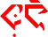
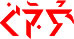
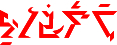
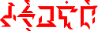

# 第 2 章 形态音位学
形态音位学指语言如何使用其音位（有意义的声音）和音位特征（例如，重音，声调等）来产生造词法和形态范畴的模式（例如，单数与复数，动词时态等。）去应用于单词。

## 2.1 语法分类 {#Sec2o1}

Ithkuil 形态音位学主要于黏着，次要于综合。也就是说，形态语义词干、屈折和派生形成的方式以及这些元素如何有意义地结合成单词，主要是通过将一个或多个词缀（包括前缀，后缀，中缀和间缀）加入到语义根，其中词缀本身是高度综合的（即，将许多形态范畴组合成单个音位形式）。

### 2.1.1 Ithkuil 词汇的结构 {#Sec2o1o1}

正如 [第 2.4 节](02_morpho-phonology.md#Sec2o4) 稍后讨论的那样，在 Ithkuil 中与西方语言中的名词和动词对应的词类部分称为 **构成词(formative)**。Ithkuil 构成词的形态结构可以通过以下公式表示：

<strong> 
  (((Cv +) Vʟ +) Cg/Cs<strong> +</strong>) Vr + (Cx/Cv + Vp/Vʟ +) Cr + Vc<strong> (+ Ci +<strong><strong>Vi</strong></strong>) </strong> + Ca (+ VxC ) (+ Vf (+ ’Cb)) [+ 声调][+ 重音]</strong> 

上述术语，除了 **Cr** , **[声调]** 和 **[重音]**，皆指各种辅音或元音词缀。 **Cr** 对应于词根本身，这在下面的 [第 2.2 节](02_morpho-phonology.md#Sec2o2) 讲述。 所有以灰色显示的术语都是可选的。 然而，如公式中括号的模式所示，某些术语的存在决定于其他的也是否存在。

上述形态公式可以看作一系列编号的「位」，这将有助于每个术语的解释：

|                1(I)                 |              2(II)               |               3(III)                |    4(IV)     |                5(V)                 |                6(VI)                | 7(VII) | 8(VIII) |                9(IX)                 |         10(X)          |              11(XI)              |             12(XII)              |              13(XIII)               | 14(XIV) |  15(XV)   |
| :---------------------------------: | :------------------------------: | :---------------------------------: | :----------: | :---------------------------------: | :---------------------------------: | :----: | :-----: | :----------------------------------: | :--------------------: | :------------------------------: | :------------------------------: | :---------------------------------: | :-----: | :-------: |
| (((Cv) | Vʟ) | Cg/Cs) |      Vr      | (Cx/Cv | Vp/Vʟ) |   Cr   |   Vc    | Ci + Vi |           Ca           | VxC | (Vf | (’Cb)) |   声调    |    重音     |
|           相位 + 言准 (+ 语为)            |                配价                |           言据 OR 时体 (+ 语式)           | 模式 + 词干 + 功能 |       併入词根 OR 相位 + 言准 (+ 语为)        |       併入词根的模式 + 词干 + 指派 OR 配价       |   词根   |    格    |               语为 + 语式                | 本质 + 限域 + 视界 + 构型 + 系属 |               派生后缀               |             语境 + 格式              |                 观感                  |   版本    | 指派 + 框架关系 |

以下 表 3 给出了这些术语的简短初步说明。这些术语的详细解释见下一章节或后续章节。

##### 表 3: Ithkuil 构成词的形态公式中术语的解释

|  位   |                   术语                    | 详述                                       |
| :--: | :-------------------------------------: | :--------------------------------------- |
|  I   |   **Cv**   | 一个词首辅音前缀，表示相位(见 [第 5.5 节](05_verbs_1.md#Sec5o5))和言准(见 [第 5.6 节](05_verbs_1.md#Sec5o6))范畴 ，相位和言准都是强制性范畴，在构成词，如果相位和言准都是默认值的话，**Cv** 的存在是可选的（即，不标记）。如果 **Cv** 出现在第 1 位，则必须填写第 2 至 4 位（见下文），并且第 3 位必须填充 **Cs**，而不是 **Cg** |
|  II  |   **Vʟ**   | 一个元音词缀，表示动词（Verbal）范畴，叫做配价，在 [第 5.7 节](05_verbs_1.md#Sec5o7) 讨论。 配价是强制性范畴，但，如果构成词的配价具有默认值 **和** 第 1 位 (**Cv**)不填写/不标记，**Vʟ** 就是可选的（即，不标记）。如果存在 **Vʟ** ，則也必須填充下面的第 3、4 位 |
| III  | **Cg/Cs**  | 辅音词缀，表示两个范畴中的任一个：(1) 言据 (见 [第 5.9 节](05_verbs_1.md#Sec5o9)), 在这种情况下，这个术语被称为 **Cg**, 或 (2) 时体, 在这种情况下，这个术语被称为 **Cs**。**Cg** 和 **Cs** 的实际语音形式彼此不同，所以在解释哪个范畴被传达时不会有任何混淆。第 1 位有 **Cv** 的话，第3位只能填 **Cs**，而不是 **Cg**。  时体 (**Cs**) 是可选范畴。构成词可以不携带任何特定的时体，在这种情况下，**Cs** 的值（如果存在）将只是一个占位符的辅音形式。  言据 (展现为 **Cg**) 是强制性范畴， 但，如果构成词的配值为默认，则 **Cg** 为可选。如果构成词的言据 **不是** 默认值，但是由于第 3 位已经被 **Cs** 填充，**Cg** 的存在是不允许的，那么这个词必须进行重组，从第 1 位中删除 **Cv**，并从第 3 位中删除 **Cs** 以允许 **Cg** 的存在。构成词的相位、言准 (**Cv**) 和时体 (**Cs**) 将通过使用附属词显示（见下文 [第2.4.2节](02_morpho-phonology.md#Sec2o4o2)），或者分别将 **Cv** 和 **Cs** 移动到第 5 和 11 位（如果有可能，请参见下面的第 5 和 11 位的说明）。  在第 3 位中存在 **Cg** 或 **Cs** 时需要填补第 4 位 |
|  IV  |                 **Vr**                  | 元音「混成词」词缀（即，传达多种类型的形态信息），表明以下形态范畴：模式和词干（见下面 [第 2.2.2 节](02_morpho-phonology.md#Sec2o2o2)）、和功能（在 [第 5.1 节](05_verbs_1.md#Sec5o1)讨论）。全部构成词都需要模式和词干，而格式只有在构成词携带合并的词干（见下文第 5 位中的 **Cx**）时才会发生 |
|  V   | **Cx/Cv**  | 第 5 位提供两个可能的功能：(1) 表示併入词根的辅音形式（在 [第 6.4 节](06_verbs_2.md#Sec6o4)讨论） 或者，在没有併入词根的情况下，它变成 (2) **Cv**的位，显示构成词的相位和言准（由此从上面的第 1 位移动它）。第 5 位的 **Cx** 或 **Cv** 的存在要求第 6 位也被填充。  如果作为 **Cx**，构成词必须携带下面第 12 位中的术语 **Vf** 所示的格式信息。如果第 12 位没有格式，则第 5 位中的任何术语都必须为 **Cv**，而不是 **Cx**。  如果没有併入词根，并且构成词的相位和言准具有其默认值或已经在第 1 位中显示，则第 5 位为空（以及第 6 位） |
|  VI  | **Vp/Vʟ**  | 第 6 位提供两个可能的功能： (1) **Vp**, 元音词缀，意味词干和模式 (见下面 [第 2.2.2 节](02_morpho-phonology.md#Sec2o2o2) ) 以及在上面第 5 位併入词根 **Cx** 的指派 (见 [第 3.7 节](03_morphology.md#Sec3o7)) ，或者，在没有併入词根的情况下，它变成 (2) **Vʟ** 的位，显示构成词的配价（由此从上面的 第 2 位 移动它） 。 如果没有併入词根，则 第 6 位 同 第 5 位 一起留空 |
| VII  |                 **Cr**                  | 强制性的辅音形式 (长度 1 至 5 个辅音) ，它代表构成词的语义词根 (见下面 [第 2.2 节](02_morpho-phonology.md#Sec2o2) )。 **Cr** 不能是 -**w**-, -**y**-, -**h**-, -**hw**-, -**hr**-, -**hh**-, -**hn**-, -**hm**-, -**lw**-, -**ly**-, -**rw**-, -**ry**-, -**řw**-, 或 -**řy**- |
| VIII |                 **Vc**                  | 强制性的元音词缀，表示构成词的格格的范畴在 [第 4 章](04_case.md) 讨论 |
|  IX  | **Ci +Vi** | 辅音 + 元音术语，由四个辅音形式之一组成 ( **w**-, **y**-, **h**-, 或 **hw**-) 加一个元音形式，整个表示构成词的语式和语为 (分别见 [第 5.2 节](05_verbs_1.md#Sec5o2) 和 [第 5.3 节](05_verbs_1.md#Sec5o3))语式和语为是强制性范畴但都有默认形式。 如果语式和语为处于默认形式，则第 9 位将通常无填充 / 无标记 |
|  X   |                 **Ca**                  | 强制性辅音混成词词缀，表示以下五个范畴：本质、限域、视界 、构型和系属。这些范畴都在 [第 3 章](03_morphology.md) 讨论 |
|  XI  |  **Vx+C**  | 可选的派生后缀，来自形式元音 **+** 辅音（可能多于一个） ，其传达额外的形态语义信息。 有大约 200 个这样的后缀可以与构成词组合以扩展单词的含义。这些后缀也可以多次添加到词干中，即两个或更多个这样的词缀可出现在词干上。这些后缀在 [第 7 章](07_suffixes.md) 中详细分析 |
| XII  |   **Vf**   | 元音后缀，其传达语境(在 [第 3.6 节](03_morphology.md#Sec3o6) 讨论)和格式(在 [第 6.4 节](06_verbs_2.md#Sec6o4) 讨论)范畴。格式信息的存在依赖有併入词根的构成词（即上述第 5 位中的 **Cx** 項）。在没有併入词根的情况，**Vf** 只传达语境范畴。虽然上下文是强制性的，但它具有默认值，在第 13 位中没有格式和观感后缀的情况下，不标记 (即 第 12 位 为空) |
| XIII |  **’Cb**   | 声门停顿形式的辅音词尾后辍 + 辅音，表示 48 个观感范畴之一 (在 [第 5.11 节](05_verbs_1.md#Sec5o11) 讨论)。观感是可选范畴，如果不存在则不标记，但如果存在，则第 12 位得填上 |
| XIV  |                 **声调**                  | Ithkuil 构成词的六种形态相关的声调 (见 [第 1.3.2 节](01_phonology.md#Sec1o3o2)) ，表示版本范畴 (见 [第 5.8 节](05_verbs_1.md#Sec5o8))，强制性范畴 |
|  XV  |                 **重音**                  | 如前面 [第 1.3.3 节](01_phonology.md#Sec1o3o3) 所述， Ithkuil 构成词有四种可能的重音方式, 其传达了指派范畴 (见 [第 3.7 节](03_morphology.md#Sec3o7)) 和框架关系 (见 [第 5.4 节](05_verbs_1.md#Sec5o4)) |

基于上述形态公式，我们可以看到，构成词的最简结构是：

**
Vr + Cr + Vc  + Ca + 声调 + 重音
**

如下面的例子：**pʰal**,  **eqoec**,  和  **‾üaklaršlá** 所示：

**pʰal** 「一棵树」

 <audio src="sound_files/2-1-1a.mp3" controls="controls" preload="auto">Your browser does not support the audio tag. 您的浏览器不支持 Audio 标签。</audio>

> Vr = (**a-**)[^1],  词根的 模式 1, 词干 1 + `静态` 功能
>
> Cr = -**pʰ-**, 词根：【木本植物】
>
> Vc = -**a-**,  `内容` 格
>
> Ca = -**l**, `正常` 本质, `全限域` 限域, `个例界` 视界, `单` 构型, 和 `自然属` 系属
>
> 声调 = 降, `进程版` 版本
>
> 重音 = 倒数第二[^2], `非正式` 指派 和 `非框架` 框架关系
>
> [^1]: 注意，完整形式是 **apʰal**, 但当 **Vr** 的值为词首 **a**- 时，对于带倒数第二音节重音的构成词，首 **a**- 可删除。
>
> [^2]: 如 [第 1.3.3 节](01_phonology.md#Sec1o3o3) 所述，单音节词被认为具有形态音位宗旨的倒数第二个音节重音。

**eqoec** 「关于人性」

 <audio src="sound_files/2-1-1b.mp3" controls="controls" preload="auto">Your browser does not support the audio tag. 您的浏览器不支持 Audio 标签。</audio>

> Vr = **e-**,  词根 的 模式 1, 词干 2 + `静态` 功能
>
> Cr = -**q-**, 词根：【高等生物】
>
> Vc = -**oe-**,  `关于` 格
>
> Ca = -**c**, `正常` 本质, `全限域` 限域, `无形界` 视界, `单` 构型, 和 `自然属` 系属
>
> 声调 = 降, `进程版` 版本
>
> 重音 = 倒数第二, `非正式` 指派 和 `非框架` 框架关系

**‾üaklaršlá** 「（它）是一组想像的乾涸的人工河道」

 <audio src="sound_files/2-1-1c.mp3" controls="controls" preload="auto">Your browser does not support the audio tag. 您的浏览器不支持 Audio 标签。</audio>

> Vr = **üa-**,  词根 的 模式 3, 词干 1 + `表态` 功能
>
> Cr = -**kl-**, 词根：【流动水】
>
> Vc = -**a-**,  `内容` 格
>
> Ca = -**ršl(a)**, `假想` 本质, `渐消域` 限域, `个例界` 视界, `群` 构型, 和 `一致属` 系属
>
> 声调 = 高, `完成版` 版本
>
> 重音 = 最终, `正式` 指派 和 `非框架` 框架关系

离开上述较简单的构成词结构，我们可检查越来越复杂的单词，例如：

<strong>Vr + Cr + Vc + Ci +Vi + Ca + Vx+Cs + Vf + ’Cb + 声调 + 重音</strong> ，比方说：

**Uipʰawâtļûxe’ň?** 「可能碰巧是个『大树林』吗？」

 <audio src="sound_files/2-1-1d.mp3" controls="controls" preload="auto">Your browser does not support the audio tag. 您的浏览器不支持 Audio 标签。</audio>

> Vr = (**ui-**),  词根 的 模式 1, 词干 1 + `表态` 功能
>
> Cr = -**pʰ-**, 词根：【木本植物】
>
> Vc = -**a-**,  `内容` 格
>
> Ci+Vi = **w**+**â**, `提问句式` 语为 + `虚拟式` 语式
>
> Ca = -**tļ**, `正常` 本质, `全限域` 限域, `个例界` 视界, `队` 构型, 和 `自然属` 系属
>
> Vx+Cs = **û**+**x**, `尺寸` 后缀，程度 6, 翻译为 【大】
>
> Vf = **e**, `寓意` 语境
>
> Cb = **ň**, `偶运观` 观感
>
> 声调 = 降, `进程版` 版本
>
> 重音 = 倒数第二, `非正式` 指派 和 `非框架` 框架关系

或者， <strong>Cg + Vr + Cx + Vp + Cr + Vc + Ca + Vx+Cs + Vf + 声调 + 重音</strong> ，比方说：

**hremsoqaiţsurkoi** 「据说是借助于人类所有各种不同特性所产生的价值」

 <audio src="sound_files/2-1-1e.mp3" controls="controls" preload="auto">Your browser does not support the audio tag. 您的浏览器不支持 Audio 标签。</audio>

> Cg = **hr**-, `报告据` 言据
>
> Vr = **e**-,  词根 的 模式 1, 词干 2 + `静态` 功能
>
> Cx = -**ms**-, 併入词根：【值/价】
>
> Vp = **o**, 模式 2, 词干 1, 和 併入词根的`非正式` 指派
>
> Cr = -**q**-, 主词根: 【高等生物】
>
> Vc = -**ai**-,  `工具` 格
>
> Ca = -**ţs**-, `正常` 本质, `全限域` 限域, `无形界` 视界, `组合` 构型, 和 `分化属` 系属
>
> Vx+Cs = **u**+**rk**, `转喻类型` 后缀，程度 9, 构成词的 「特性代拥有者」
>
> Vf = **oi**, `融合` 语境 和 `效果` 格式
>
> 声调 = 降, `进程版` 版本
>
> 重音 = 倒数第二, `非正式` 指派 和 `非框架` 框架关系

或一个刻意极端的例子， <strong>Cv + Vʟ + Cs + Vr + Cx + Vp + Cr + Vc + Ca + Vx + Cs + Vf + ’Cb + 声调 + 重音</strong> ，如：

 

**/qʰûl-lyai’svukšei’arpîptó’ks** 「……很难相信，据称之后一群毫无组织纪律的可疑小丑试图重新开始灌输恐惧，尽管未遂」 

<audio src="sound_files/2-1-1f.mp3" controls="controls" preload="auto">Your browser does not support the audio tag. 您的浏览器不支持 Audio 标签。</audio>

> Cv =  **qʰ**,  `声称` 言准 + `重复` 相位
>
> Vʟ  =  **û**,  `拒动` 配价
>
> Cs  =  **l-ly**,  `重返` 时体
>
> Vr  =  **ai’**,  `动态` 功能 + 主词根 的 模式 1, 词干 2
>
> Cx  =  **sv**,  併入词根:  【恐惧/害怕/受惊】
>
> Vp  =  **u**,  `非正式` 指派 + 併入词根 的 模式 3, 词干 1 
>
> Cr  =  **kš**,  主词根: 【笑天下可笑之人】
>
> Vc  =  **ei’a**,  `之後` 格
>
> Ca  =  **rp**,  `正常` 本质, `全限域` 限域, `无限` 视界, `群` 构型, 和 `分化` 系属
>
> Vx + Cs  = -**îpt**,  `虚假度` 后缀，程度 4,  表示可疑
>
> Vf  =  **o**,  `方式` 格式 和 `存在` 语境
>
> Cb =  **’ks**,  `怀疑` 观感
>
> 声调  =  升,  `未遂` 版本
>
> 重音  =  最终音节,  主词根 的 `正式` 指派 

### 2.1.2 词中特定词缀的消岐 {#Sec2o1o2}

因为上述形态公式中的许多术语都是可选的，所以读者可能会怀疑 Ithkuil 的说话者/读者当看着或听到 Ithkuil 词时，如何可能知道在任何给定的单词中实际呈现出哪些术语，即，如何从特定单词中给定的辅音和元音，解释哪些可选的形态范畴被显示或说出。或者，换句话说，如何得知哪些位被填充？事实上，由于每个术语允许的特定合法辅音或元音组合，这样的解释确实有可能，并且是明确的，即，对于另一个术语可能在特定单词中佔据相同的顺序位置，一个术语合法的特定辅音或元音值会与另一个合法的有所不同。另外，如上文 [第 2.1.1 节](02_morpho-phonology.md#Sec2o1o1) 所述及如在形态公式 **(((Cv +) Vʟ +) Cg/Cs +) Vr + (Cx/Cv + Vp/Vʟ +) Cr + Vc (+ Ci +Vi) + Ca (+ VxC ) (+ Vf (+ Cb)) \[+ 声调\]\[+ 重音\]** 中的括号格局所示，某些术语，例如 **Vʟ** 的存在需要存在其他术语 (**Ci + Vc**)，以便维持可明确区分的可辨别排序。

## 2.2 词根与词干构成 {#Sec2o2}

在 Ithkuil 中的所有单词，与英语对应的话，就像名词或动词，它们都是以单音节词干为基础的，这又源于语义上的抽象词根。这个过程在下面章节中解释。

### 2.2.1 词根 {#Sec2o2o1}

Ithkuil 中的 **词根** 构成语义基础，从中派生出实际 名词/动词 词干。辅音形式的词根结构 **Cr** ，由一至四个辅音组成 (如 -**k**-, -**st**-, -**ntr**-, -**pstw**-)。鉴于 Ithkuil 语音组合限制（见 [第 1.4 节](01_phonology.md#Sec1o4)），这样可以产生约 3600 个可能的根。（注：五个辅音的词根，例如 -**rpskw**- 在语音组合上也是可能且可用的，但目前仍未分配。）**Cr** 不能是单个声门塞音，也不能是 **w、y、h、hw、hr、hh、hn、hm、lw、ly、rw、ry、řw** 或 **řy**。词根占据构成词的形态音位结构的第 7 位，如下所示。

<table width="982" border="1" cellpadding="0" cellspacing="0"><tbody><tr><td width="70" height="31" valign="top">
1(I)</td><td width="59" valign="top">
2(II)</td><td width="61" valign="top">
3(III)</td><td width="54" valign="top">
4(IV)</td><td width="85" valign="top">
5(V)</td><td width="142" valign="top">
6(VI)</td><td width="30" valign="top" bgcolor="#FFFFCC">
7(VII)</td><td width="28" valign="top">
8(VIII)</td><td width="60" valign="top">
9(IX)</td><td width="104" valign="top">
10(X)</td><td width="36" valign="top">
11(XI)</td><td width="64" valign="top">
12(XII)</td><td width="47" valign="top">
13(XIII)</td><td width="46" valign="top">
14(XIV)</td><td width="64" valign="top">
15(XV)</td></tr><tr><td height="51" valign="middle">
<strong>(((Cv)</strong></td><td valign="middle">
<strong>Vʟ)</strong></td><td valign="middle">
<strong>Cg/Cs)</strong></td><td valign="middle">
<strong>Vr</strong></td><td valign="middle">
<strong>(Cx/Cv</strong></td><td valign="middle">
<strong>Vp/Vʟ<strong>)</strong></strong></td><td valign="middle" bgcolor="#FFFFCC">
<strong>Cr</strong></td><td valign="middle">
<strong>Vc</strong></td><td valign="middle">
<strong><strong>Ci +<strong><strong>Vi</strong></strong></strong></strong></td><td valign="middle">
<strong>Ca</strong></td><td valign="middle">
<strong>VxC</strong></td><td valign="middle">
<strong>(Vf</strong></td><td valign="middle">
<strong> (’Cb))</strong></td><td valign="middle">
<strong>声调</strong></td><td valign="middle">
<strong>重音</strong></td></tr><tr><td height="105" valign="top">
相位 + 言准 (+ 语为)
</td><td valign="top">配价</td><td valign="top">言据 OR 时体(+ 语式)</td><td valign="top">模式 + 词干 + 功能</td><td valign="top">併入词根 OR 相位 + 言准 (+ 语为)</td><td valign="top">併入词根的模式 + 词干 + 指派 OR 配价</td><td valign="top" bgcolor="#FFFFCC">词根</td><td valign="top">格</td><td valign="top">语为 + 语式</td><td valign="top">本质 + 限域 + 视界 + 构型 + 系属</td><td valign="top">派生    后缀</td><td valign="top">语境 + 格式</td><td valign="top">观感</td><td valign="top">版本</td><td valign="top">指派 + 框架关系</td></tr></tbody></table>

词根是 Ithkuil 中的基本语义单位。例如， **d**- 是一个词根，它的语义指示为【名字/所指】。功能性词干（或只是词干）通过 **Vr**- 元音词缀的实例从词根生成，如下所述。

### 2.2.2 词干与模式 {#Sec2o2o2}

每个词根有三个相关词干，词干级别使 Ithkuil 词根成为有实例意义的实词。每个词干依次表现在三种不同的 **模式** 中。模式和词干都是通过改变 **Vr**- 元音词缀来表示的。

这三种模式标记为 模式 1，模式 2 和模式 3。这三种模式标记为 模式 1，模式 2 和模式 3。模式用于将词干分成由一个整体词干和两个互补词干组成的三组。一个例子可以是整体词干 **配偶**，其两个互补词干，**丈夫** 和 **妻子**。整体与互补的区别将在 [第 2.3 节](02_morpho-phonology.md#Sec2o3) 中进行讨论。整体与互补模式的区别是 Ithkuil 在其他语言构成词汇区别的形态层面系统化的一种方式（即翻译时的词选差异）。它是 Ithkuil 作为一个概念复杂且微妙的语言充分发挥作用的许多方式之一，同时拥有如此少量的语义词根。

一个构成词的模式和词干由第 4 位中的 **Vr** 词缀表示，如前面 [第 2.1.1节](02_morpho-phonology.md#Sec2o1o1) 所述。除了表示构成词的模式和词干，**Vr** 也表示功能的形态范畴，在 [第 5.1 节](05_verbs_1.md#Sec5o1) 中讨论。

<table width="982" border="1" cellpadding="0" cellspacing="0"><tbody><tr><td width="70" height="31" valign="top">
1(I)</td><td width="59" valign="top">
2(II)</td><td width="61" valign="top">
3(III)</td><td width="54" valign="top" bgcolor="#FFFFCC">
4(IV)</td><td width="85" valign="top">
5(V)</td><td width="142" valign="top">
6(VI)</td><td width="30" valign="top">
7(VII)</td><td width="28" valign="top">
8(VIII)</td><td width="60" valign="top">
9(IX)</td><td width="104" valign="top">
10(X)</td><td width="36" valign="top">
11(XI)</td><td width="64" valign="top">
12(XII)</td><td width="47" valign="top">
13(XIII)</td><td width="46" valign="top">
14(XIV)</td><td width="64" valign="top">
15(XV)</td></tr><tr><td height="51" valign="middle">
<strong>(((Cv)</strong></td><td valign="middle">
<strong>Vʟ)</strong></td><td valign="middle">
<strong>Cg/Cs)</strong></td><td valign="middle" bgcolor="#FFFFCC">
<strong>Vr</strong></td><td valign="middle">
<strong>(Cx/Cv</strong></td><td valign="middle">
<strong>Vp/Vʟ<strong>)</strong></strong></td><td valign="middle">
<strong>Cr</strong></td><td valign="middle">
<strong>Vc</strong></td><td valign="middle">
<strong><strong>Ci +<strong><strong>Vi</strong></strong></strong></strong></td><td valign="middle">
<strong>Ca</strong></td><td valign="middle">
<strong>VxC</strong></td><td valign="middle">
<strong>(Vf</strong></td><td valign="middle">
<strong> (’Cb))</strong></td><td valign="middle">
<strong>声调</strong></td><td valign="middle">
<strong>重音</strong></td></tr><tr><td height="105" valign="top">
相位 + 言准 (+ 语为)
</td><td valign="top">配价</td><td valign="top">言据 OR 时体(+ 语式)</td><td valign="top" bgcolor="#FFFFCC">模式 + 词干 + 功能</td><td valign="top">併入词根 OR 相位 + 言准 (+ 语为)</td><td valign="top">併入词根的词干类型 + 词干 + 指派 OR 配价</td><td valign="top">词根</td><td valign="top">格</td><td valign="top">语为 + 语式</td><td valign="top">本质 + 限域 + 视界 + 构型 + 系属</td><td valign="top">派生    后缀</td><td valign="top">语境 + 格式</td><td valign="top">观感</td><td valign="top">版本</td><td valign="top">指派 + 框架关系</td></tr></tbody></table>

**Vr**- 的值，由在下表 4 所示其词干和模式及功能。

<table border="1" cellspacing="0" cellpadding="0"><tbody><tr><td width="174" valign="top"></td><td colspan="3" valign="top">
<strong>模式 1</strong>
</td><td colspan="3" valign="top">
<strong>模式 2</strong>
</td><td colspan="3" valign="top">
<strong>模式 3</strong>
</td></tr><tr><td width="174" valign="top"></td><td width="80" valign="top">
词干 1
</td><td width="80" valign="top">
词干 2
</td><td width="80" valign="top">
词干 3
</td><td width="80" valign="top">
词干 1
</td><td width="80" valign="top">
词干 2
</td><td width="80" valign="top">
词干 3
</td><td width="80" valign="top">
词干 1
</td><td width="80" valign="top">
词干 2
</td><td width="80" valign="top">
词干 3
</td></tr><tr><td valign="top">
<strong>功能</strong> (见 <a href="05_verbs_1.md#Sec5o1">第 5.1 节</a>)
</td><td valign="top"></td><td valign="top"></td><td valign="top"></td><td valign="top"></td><td valign="top"></td><td valign="top"></td><td valign="top"></td><td valign="top"></td><td valign="top"></td></tr><tr><td width="174" valign="top">
静态
</td><td width="80" valign="top">
(a)
</td><td width="80" valign="top">
e
</td><td width="80" valign="top">
u
</td><td width="80" valign="top">
o
</td><td width="80" valign="top">
ö
</td><td width="80" valign="top">
î / û
</td><td width="80" valign="top">
â
</td><td width="80" valign="top">
ê
</td><td width="80" valign="top">
ô
</td></tr><tr><td width="174" valign="top">
动态
</td><td width="80" valign="top">
i
</td><td width="80" valign="top">
ai
</td><td width="80" valign="top">
ei
</td><td width="80" valign="top">
au
</td><td width="80" valign="top">
eu
</td><td width="80" valign="top">
iu
</td><td width="80" valign="top">
ia / ua
</td><td width="80" valign="top">
ie / ue
</td><td width="80" valign="top">
io / uo
</td></tr><tr><td width="174" valign="top">
表态
</td><td width="80" valign="top">
ui
</td><td width="80" valign="top">
ü    / ou
</td><td width="80" valign="top">
ëi
</td><td width="80" valign="top">
ae
</td><td width="80" valign="top">
ea
</td><td width="80" valign="top">
oa
</td><td width="80" valign="top">
üa /    aì
</td><td width="80" valign="top">
iù / uì
</td><td width="80" valign="top">
iö / uö
</td></tr><tr><td width="174" valign="top">
形容
</td><td width="80" valign="top">
oi
</td><td width="80" valign="top">
eo
</td><td width="80" valign="top">
eö
</td><td width="80" valign="top">
oe
</td><td width="80" valign="top">
öe
</td><td width="80" valign="top">
ëu
</td><td width="80" valign="top">
üo /    oì
</td><td width="80" valign="top">
üe /    eì
</td><td width="80" valign="top">
üö / aù
</td></tr></tbody></table>

在下面我们分析句子语义的章节中，所有例子都在 `静态` 功能中给出，因为它是构成词的最常见（或默认）的功能。因此，我们将分析的形式是：

<table border="1" align="center" cellpadding="0" cellspacing="0"><tbody><tr valign="middle"><td height="28" colspan="3">
模式 1
</td><td colspan="3">
模式 2
</td><td colspan="3">
模式 3
</td></tr><tr><td width="80" height="28" valign="middle">
词干 1
</td><td width="80" valign="middle">
词干 2
</td><td width="80" valign="middle">
词干 3
</td><td width="80" valign="middle">
词干 1
</td><td width="80" valign="middle">
词干 2
</td><td width="90" valign="middle">
词干 3
</td><td width="78" valign="middle">
词干 1
</td><td width="82" valign="middle">
词干 2
</td><td width="70" valign="middle">
词干 3
</td></tr><tr><td width="80" height="47" valign="middle">
(a)C-
</td><td width="80" valign="middle">
eC-
</td><td width="80" valign="middle">
uC-
</td><td width="80" valign="middle">
oC-
</td><td width="80" valign="middle">
öC-
</td><td width="90" valign="middle">
îC- / ûC-
</td><td width="78" valign="middle">
âC-
</td><td width="82" valign="middle">
êC-
</td><td width="70" valign="middle">
ôC-
</td></tr></tbody></table>

其中 **C**- 代表词根辅音形式 **Cr**。

## 2.3 词干的语义实例 {#Sec2o3}

我们现在可以检查每个词根如何将意义实例化为上述排序的词干。我们将从与模式 1 相关的三个词干开始；都是整体词干。在随后的一节中将分析与模式 2 和 3 相关的十二个词干，即互补词干。

### 2.3.1 整体词干 {#Sec2o3o1}

Pattern 1 的三个词干分别由 Vr 词缀 (a-), e- 和 u- 构成。因此，可从词根 -**d**-【名字/称号】生成以下词干：

> 1. **(a)d-** ：「某人或物的名称；命名某人或物」
> 2. **ed-**  ：「称号或参考；指定一个称号，参考某物」
> 3. **ud-**  ：「一个(临时或非正式的)参考，外号；给予(临时或非正式的)参考或名字，(临时)起外号」
>

对每个词根来说，词干之间以及跟词根的语义关系都不一样。不过还是有些规律的。词干 1 通常表示最基本,普通的核心概念，词干 2 表示具体的应用或表现，或是词干 1 的次级概念。词干 3 表示更具体的应用或表现,或是词干 1 的更次级的概念,或是一个扯得比较远的概念。我们再用词根 -**x**-【视觉】来与上面的词根 -**d**- 比较之间的关系来举例说明：

> 1. **(a)x-** ：「视觉，视觉行为」
> 2. **ex-** ：「眼睛；是/成为/使用 眼睛」
> 3. **ux-** ：「脑里的映像；视觉化，在脑里描绘」

注意：每个词干既能表示名词意义，也能表示动词意义。稍后当我们讨论词类和 名词性/动词性 形态学时，这将是重要的。

### 2.3.2 互补词干 {#Sec2o3o2}

任何 Ithkuil 词干都能够进一步分解成两个 **互补** 词干，它们代表主词干的相互排斥的组成部分或方面。许多 Ithkuil 词干，翻译常见的英语名词和动词时，都是这样的互补的派生词，而不是整体词干。

「互补」的意思是说，某个概念在具体的语境里都有一个跟它【既互不兼容又互相依存】的概念。例如，**男、夜、说话、坐、发生** 等等在 Ithkuil 里不被认为是基本概念，而是某个整体概念的一部分，即互补概念，与另一个跟它一样的互补概念同时存在，两个共同构成一个整体。

因此在 Ithkuil 里，「男」这个词如果没有一个与它互补的对象即「女」的话则完全没有意义；两个词都应由一个更基本更整体的概念【高等生物/人】派生而来。类似地，「夜」与「日(白天)」同时派生自【日(24小时)】这个概念；基本概念【说】则划分为「讲」(发声行为本身)及「话」(表达的内容)两个互补概念。

行动也不能免除这种互补性原则，如，「坐」与「座」，一个概念不能脱离另一个独立存在，即，你如果没有一个座位的话你没法坐；而如果你不坐，那个东西不能称作一个座位；只要你坐，就有一个充当座位的东西。再如「发生」一词，Ithkuil 认为没有「结果」伴随的暗示就没有真正意义，这两个是一个整体概念的互补对象，大致可以翻译成「事件」或「处境」一词。

#### 2.3.2.1 用 模式 2 和 3 派生互补词干 {#Sec2o3o2o1}

互补词干 1 可从整体词干以移动 **Vr** 的值到 模式 2 的方式派生，即，**o**-, **ö**- 和 **î**- (或 **û**-)，而互补词干 2 可被以移动**Vr** 的值到 模式 3的方式派生，即，**â**-, **ê**-, 和 **ô**-。互补词干派生的几个例子如下：

<table width="101%" border="0" cellpadding="0"><tbody><tr><td width="49%"><table width="94%" border="1" cellpadding="0"><tbody><tr><td width="39%" height="31" bgcolor="#CCCCCC">整体词干</td><td width="66%">
<strong>eq-</strong>: 人
</td></tr><tr><td height="31" bgcolor="#CCCCCC">互补词干 1</td><td width="66%">
<strong>öq-</strong>: 男人
</td></tr><tr><td height="33" bgcolor="#CCCCCC">互补词干 2</td><td width="66%">
<strong>êq-</strong>: 女人
</td></tr></tbody></table></td><td width="1%"></td><td width="50%"><table width="100%" border="1" cellpadding="0"><tbody><tr><td width="28%" height="30" bgcolor="#CCCCCC">整体词干</td><td width="67%">
<strong>aklá-</strong>: 河
</td></tr><tr><td height="37" bgcolor="#CCCCCC">互补词干 1</td><td width="67%">
<strong>oklá-</strong>: 河水
</td></tr><tr><td height="29" bgcolor="#CCCCCC">互补词干 2</td><td width="67%">
<strong>âklá-</strong>: 河床
</td></tr></tbody></table></td></tr></tbody></table>

<table width="101%" border="0" cellpadding="0"><tbody><tr><td width="49%" height="168"><table width="95%" border="1" cellpadding="0"><tbody><tr><td width="31%" height="67" bgcolor="#CCCCCC">整体词干</td><td width="68%">
<strong>ult-</strong>: 写
</td></tr><tr><td height="66" bgcolor="#CCCCCC">互补词干一</td><td width="68%">
<strong>ûlt-</strong>: 写的行为（物理上的）
</td></tr><tr><td height="55" bgcolor="#CCCCCC">互补词干二</td><td width="68%">
<strong>ôlt-</strong>: 写的内容
</td></tr></tbody></table></td><td width="1%"></td><td width="50%"><table width="100%" border="1" cellpadding="0"><tbody><tr><td width="31%" height="52" bgcolor="#CCCCCC">整体词干</td><td width="69%">
<strong>ax-</strong>: 视觉事件
</td></tr><tr><td height="76" bgcolor="#CCCCCC">互补词干一</td><td width="69%">
<strong>ox-</strong>: 视觉行为，看/见
</td></tr><tr><td height="58" bgcolor="#CCCCCC">互补词干二</td><td width="69%">
<strong>âx-</strong>: 视觉内容/对象；投射映像
</td></tr></tbody></table></td></tr></tbody></table>

#### 2.3.2.2 翻译中的互补词干 {#Sec2o3o2o2}

如上所述，Ithkuil 整体 与 互补根的结构通常与英语词汇区别完全相似，例如，【说话/讲话】分解成【说】的物理方面与【讲】的沟通方面，或是【人】分解为【男】和【女】。然而，这种互补原则通常会产生一种与西方语义概念相违背的语义情形。

我们再以词根 -**mm**- 【核心家庭成员】为例来分析下。大多数语言里「父母」跟「孩子」是互不相干的两个词, Ithkuil 则认为它们其中一个必然暗含另一个。没有孩子没人能做父母，正如每个孩子必然有(或曾经有)父母。于是这构成了一个原形的互补关系，可归纳到一个整体概念 **-mm-**。这词根並不表示「既是亲又是子」，那听起来挺胡闹，其实它既不表示「亲」也不表示「子」，而只是表示某个人是亲子关系里的成员，即，一个家庭成员。

<table width="87%" border="1" cellpadding="0"><tbody><tr><td height="23" bgcolor="#CCCCCC"></td><td>
整体词干
</td><td>
互补词干 1
</td><td>
互补词干 2
</td></tr><tr><td width="8%" height="39" bgcolor="#CCCCCC">词干 1</td><td width="37%">
<strong>amm</strong>- 核心家庭成员
</td><td width="27%">
<strong>omm</strong>-: 父母
</td><td width="28%">
<strong>âmm</strong>-: 子女 (子孙)
</td></tr><tr><td height="34" bgcolor="#CCCCCC">词干 2</td><td width="37%">
<strong>emm</strong>-: 男性核心家庭成员
</td><td width="27%">
<strong>ömm</strong>-: 父亲
</td><td width="28%">
<strong>êmm</strong>-: 儿子
</td></tr><tr><td height="36" bgcolor="#CCCCCC">词干 3</td><td width="37%">
<strong>umm</strong>-: 女性核心家庭成员
</td><td width="27%">
<strong>ûmm</strong>-: 母亲
</td><td width="28%">
<strong>ômm</strong>-: 女儿
</td></tr></tbody></table>

以下例子说明了单一Ithkuil词根包含了额外的概念互补对：

<table width="72%" border="1" cellpadding="0"><tbody><tr><td width="33%" bgcolor="#CCCCCC">
整体概念
</td><td colspan="2">
互补概念
</td></tr><tr><td height="33" bgcolor="#CCCCCC">吃</td><td width="32%">食物</td><td width="35%">消化</td></tr><tr><td height="37" bgcolor="#CCCCCC">思想</td><td>思想内容</td><td>思想过程</td></tr><tr><td height="35" bgcolor="#CCCCCC">液体</td><td>流体 (= 本体论性质)</td><td>潮湿 (=定义属性)</td></tr><tr><td height="34" bgcolor="#CCCCCC">度量</td><td>尺寸</td><td>度量过程</td></tr><tr><td height="35" bgcolor="#CCCCCC">予取行为</td><td>给</td><td>拿</td></tr><tr><td height="37" bgcolor="#CCCCCC">路径移动</td><td>来，到达</td><td>去，出发</td></tr><tr><td height="34" bgcolor="#CCCCCC">商业交易</td><td>买</td><td>卖</td></tr></tbody></table>

## 2.4 词类 {#Sec2o4}

Ithkuil 只有两类词：构成词(formative)和附属词(adjunct)。虽然有充当名词和动词作用的词， 但这种词在形态上都派生自同样的语法词干（其名词或动词性作用或意思取决于具体情境），故名构成词。这种从构成词 名词/动词 派生过程在下面的第 2.4.1 节中详细讨论。须注意，Ithkuil里没有形容词、副词、介词、代词、限定词、连词、小品词或叹词，至少不是在能称作词类的独立词汇层次。这些西方语法概念的等价物或替代物都在构成词-附属词的形态变化阵列里。

另一个与西方语法的不同是没有任何不规则或「残缺」词形。所有构成词和附属词都无一例外地遵从同样的屈折和派生规则，所有能通过屈折或派生得出的词理论上都存在且有意义（尽管实际上有些词形当然有可能语义上显得诡异、冗赘、生硬或作一些非必要的细微区别，其在上下文是不必要的）。

### 2.4.1 构成词 {#Sec2o4o1}

[第 2.3 节](02_morpho-phonology.md#Sec2o3) 里介绍的词干构成称为构成词的语法词类。所有构成词无一例外地都能充当名词或动词，一个构成词应诠释为名词还是动词只能通过分析它和句子其余部分的形态句法关系来区分。因此，並没有任何像西方语言里那样只表示名词或只表示动词的词干/构成词。在上面的 [第 2.3.2 节](02_morpho-phonology.md#Sec2o3o2) 描述的构成词 **aklá-** 既意为「河流」，也意为「河流」（作为一条河流流动，河在流动）【^汉语里都一样…】，没有其中哪个意思被视为更固有或基本，或其中一个派生自另一个。所谓名词义优于动词义（或反之）的等级性只有在把Ithkuil翻译到固有这种词性限制的其他语言时才会产生。一个构成词被诠释或翻译成名词还是动词形式往往是随意的。

之所以单一词类的形态派生词能同时充当名词和动词，是因为 Ithkuil 的形态语义学並不认为名词和动词在认知上有区别，毋宁说它们是共同存在于一个由空间和时间组成的底层语义连续体内的一个概念的互补显化。正如物理学里，这两者组成的整个连续体可被视为【时空】。正是在这一时空连续体内，Ithkuil 把语义概念实例化为词汇词根，从而产生叫构成词的词类。然后由使用者选择把这个构成词要么空间上“物化”成一个物体或实体（即名词），要么时间上“事化”成一个行为/事件/状态（即动词）。这一互补过程可图解如下：

### 2.4.2 附属词 {#Sec2o4o2}

除构成词外另一个词类是附属词。这样叫是因为它们是和相邻的构成词一起运作，为後者提供附加的语法信息，有点像英语里的助动词（如，“may, will, would, do, have”）或限定词（如，“the, this, those”）。

附属词由一个或以上的辅音/元音词缀以粘着方式构成。有若干不同类型的附属词，详细介绍于 [第 6 章](06_verbs_2.md) 及 [第 8 章](08_adjuncts.md)。其中包括：

指称附属词：西方语法“代词”的最接近等价物，以缩略的形式指代一个动词的参与实体或与一个名词有某种格关系的实体(见 [第 8.1 节](08_adjuncts.html#Sec8o1))。

动词附属词：与动词性的构成词一起用，以提供配价、级别、相位、言准、语为、情态、时体、观感、限域等形态范畴的信息。这些范畴在 [第 5 章](05_verbs_1.md) 及 [第 6 章](06_verbs_2.md) 详述。

[注: 附属词还有没提到的其他种类(多译为“小词”)，包括观感小词、时体小词、词缀小词、格小词以及即将增加的Ca 小词]

## 2.5 关于术语 {#Sec2o5}

本章顺带提到了一些特定的形态范畴，从 [第 3 章：基本形态学](03_morphology.md) 开始将详细讨论这些范畴。应当指出，考虑到 Ithkuil 里宏大的显式形态范畴阵列，用来命名这些范畴的术语经常是随意的。如果一个范畴的作用类似某个熟悉的语言学范畴，就採用该范畴的名字。另一些情况下，出于方便採用了来自印欧、乌拉尔、美洲本土或高加索语法的术语（往往只有一点点作用上的相似）。 再另一些则是我自己发明的语法术语。

[又注: verb“动词”译者在某些地方也会译成“谓词”；这两种译法也是随意的……]